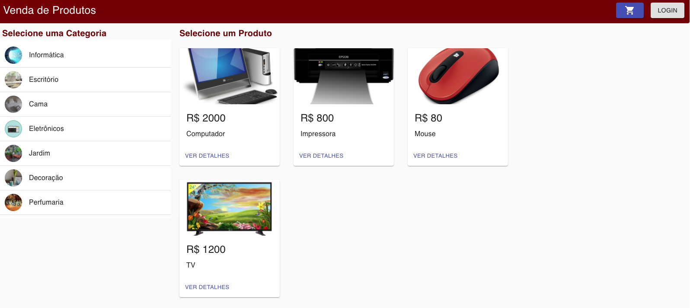
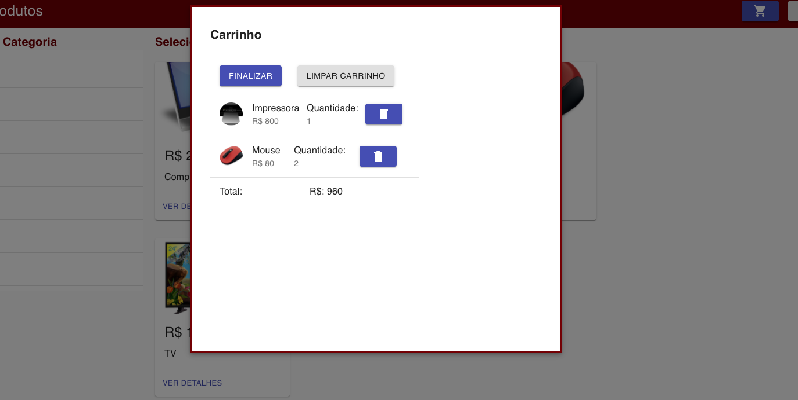
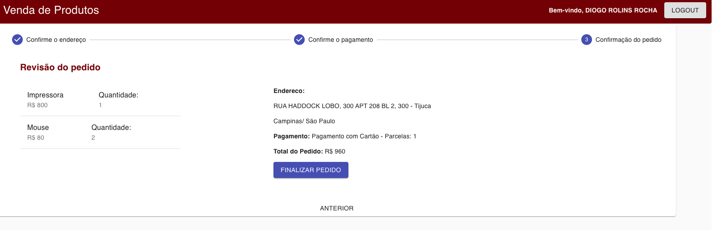

## Sistema de E-commerce

Fron End de sistema de e-commerce para terinamento de ReactJS utilizando MaterialUI.

Back End [Link do projeto](https://github.com/diogorolins/Spring-prj2-backend)

[Link para a aplicação](http://orders.diogorolins.com.br/)

  

  

  

  

